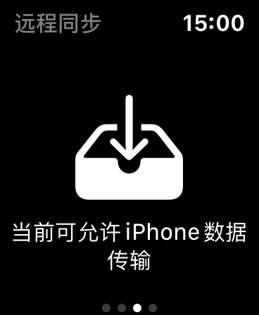
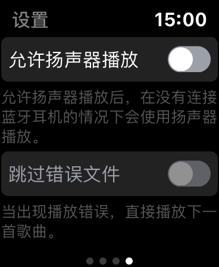

#  五点半音乐

**“五点半音乐”**是基于`Swift5`开发的`Apple Watch`本地音乐播放器，能够脱离手机进行独立播放，并且支持扬声器外放。

如果跑步或健身时不想随身携带手机，那么此应用将会是你的最佳选择（当然，你也可以为此花费每月10元订阅苹果的“音乐”服务）。

                

## 特性

* 脱离手机独立播放
* 未连接耳机的情况下，支持扬声器输出
* 自定义播放界面，支持歌曲切换
* 专辑目录，能够按喜好进行分类

## 运行

将项目导入`Xcode`，连接iPhone，选择有效的开发者证书运行即可。

> 项目仅适配了`iPhone 8 Plus`，所以其它手机或设备需要根据尺寸进行调整。

## 存在的问题

1. 基于`Page-Based`的页面模式，在页面滑动切换时很大机率会出现空白

   > 这是Apple Watch上一个通病，其它应用也有此情况，暂时没有找到解决方案。

2. iPhone与Watch传送文件不稳定

   > 尝试间隔性的将`Apple Watch`点亮，并将应用处于前台运行。若出现**传输超时**可重启设备再进行操作。

